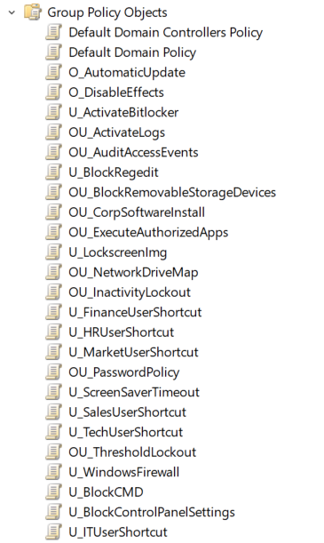

## Documentation sur la liste de GPOs à implémenter et justification des choix, ainsi que les requêtes WMI pouvant être utilisées.

###  **Les GPOs sont regroupées par thème** 

### Liste des GPOs :

### 1. Renforcement de la sécurité des postes

 **<u> Activer le chiffrement BitLocker </u>** 

**Utilisateurs concernés** : employés itinérants et utilisateurs de postes portables

**Justification :** protège les données sensibles sur les disques durs contre le vol physique.

**Paramètre :** Computer Configuration → Policies → Administrative Templates → Windows Components → BitLocker Drive Encryption → Operating System Drive :

- Require additionnal authentification at startup

 **<u> Paramètres de pare-feu Windows </u>** 

**Utilisateurs concernés** : tout le domaine

**Justification :** empêche les connexions non autorisées au sein ou en dehors du réseau.

**Paramètre :** Computer Configuration → Policies → Windows Settings → Security Settings → Windows Firewall with Advanced Security :

-

### 2. Contrôle de l'environnement utilisateur

 **<u> Bloquer l'accès au registre </u>** 

**Utilisateurs concernés** : employés non administrateurs.

**Justification :** empêche les modifications non autorisées du registre Windows.

**Paramètre :** User Configuration → Policies → Administrative Templates → System

- Prevent access to registry editing tools

 **<u> Bloquer l'accès au cmd </u>** 

**Utilisateurs concernés** : employés non administrateurs/IT.

**Justification :** empêche les commandes non autorisées dans la console.

**Paramètre :** User Configuration → Policies → Administrative Templates → System

- Prevent access to command prompt

 **<u> Restreindre l’accès aux périphériques de stockage amovibles </u>** 

**Utilisateurs concernés** : tous les utilisateurs ou groupes spécifiques nécessitant le contrôle de l’utilisation des périphériques amovibles (dans des environnements avec des données sensibles : finance, RH etc.).

**Justification :** empêche les utilisateurs d’accéder à des périphériques de stockage amovibles (clés USB, disques durs externes) pour protéger les données sensibles et éviter l’introduction de malwares.

**Paramètre :** User Configuration → Policies → Administrative Templates → System → Removable Storage Access

- All Removable Storage classes: Deny all access

 **<u> Mappage de lecteurs réseau </u>** 

**Utilisateurs concernés** : Tous les utilisateurs ou groupes spécifiques selon les besoins (RH, finance, IT...).

**Justification :** permet aux utilisateurs d'accéder aux ressources réseau de manière sécurisée et plus simple.

**Paramètre :** User Configuration → Preferences → Windows Settings → Drive Maps

- [Créer ici une nouvelle règle de mappage]

 **<u> Restreindre l'accès au control panel et aux paramètres </u>** 

**Utilisateurs concernés** : employés sans rôle IT (finance, marketing, RH)

**Justification :** empêche les modifications non autorisées pour paramètres sensibles.

**Paramètre :** User Configuration → Policies → Administrative Templates → Control Panel

- Prohibit access to Control Panel and PC settings"

 **<u> Limiter l'accès aux logiciels pouvant être utilisés </u>** 

**Utilisateurs concernés** : employés aux postes critiques et/ou avec peu de compétences techniques.

**Justification :** empêche l'installation de logiciels non autorisés et réduit le risque de malwares.

**Paramètre :** User Configuration → Policies → Administrative Templates → System

- Don't run specified Windows applications

 **<u> Personnaliser l'écran de verrouillage </u>** 

**Utilisateurs concernés** : tout le domaine.

**Justification :** améliore le corporatisme.

**Paramètre :** User Configuration → Policies → Administrative Templates → Control Panel → Personalization

- Force a specific default lock screen image

 **<u> Personnaliser l'économiseur d'écran </u>** 

**Utilisateurs concernés** : tout le domaine.

**Justification :** améliore l'ergonomie et renforce la sécurité par déconnexion automatique après inactivité.

**Paramètre :** User Configuration → Policies → Administrative Templates → Control Panel → Personalization

- Screen saver timeout

### 3. Sécurisation de la session utilisateur

 **<u> Configuration d'une politique de mots de passes strictes </u>** 

**Utilisateurs concernés** : tout le domaine.

**Justification :** améliore la sécurité par des mots de passes plus complexes.

**Paramètre :** Computer Configuration → Policies → Windows Settings → Security Settings → Account Policies → Password Policy

- Minimum password length
- Password must meet complexity requirements

 **<u> Verrouillage de comptes (après plusieurs tentatives infructueuses) </u>** 

**Utilisateurs concernés** : tout le domaine.

**Justification :** empêche les attaques par force brute et intrusions.

**Paramètre :** Computer Configuration → Policies → Windows Settings → Security Settings → Account Policies → Account Lockout Policy

- Account lockout threshold

 **<u> Déconnexion des sessions inactives </u>** 

**Utilisateurs concernés** : employés des espaces partagés (peut être étendu à tout le domaine).

**Justification :** réduit le risque lié aux postes laissés sans surveillance.

**Paramètre :** Computer Configuration → Policies → Windows Settings → Security Settings → Local Policies → Security Options

- Interactive logon: Machine inactivity limit

### 4. Gestion des logiciels et mises à jour

 **<u> Forcer les mises à jour automatiques de Windows </u>** 

**Utilisateurs concernés** : tout le domaine.

**Justification :** améliore la sécurité et la stabilité du système.

**Paramètres :** Computer Configuration → Policies → Administrative Templates → Windows Components → Windows Update

- Configure Automatic Updates

 **<u> Installation automatique de logiciels d’entreprise </u>** 

**Utilisateurs concernés** : tout le domaine mais ajuster en fonction des groupes métier.

**Justification :** assure l'installation des logiciels standard de l'entreprise.

**Paramètre :** Computer Configuration → Policies → Software Settings → Software Installation

- [Choisir ici les logiciels à installer]

 **<u> Ajouter des raccourcis </u>** 

**Utilisateurs concernés** : tout le domaine en fonction de leur groupe métier.

**Justification :** améliore l'ergonomie et le confort des utilisateurs ainsi que la productivité.

**Paramètre :** User Configuration → Preferences → Windows Settings → Shortcuts

- [Ajouter ici les racourcis à implémenter]

### 5. Surveillance et conformité

 **<u> Configurer l'audit des accès et des évènements </u>** 

**Utilisateurs concernés** : tout le domaine, avec un focus sur ceux ayant accès à des données sensibles.

**Justification :** permet de surveiller les activités suspectes et de respecter les réglementations (RGPD, etc.).

**Paramètre :** Computer Configuration → Policies → Windows Settings → Security Settings → Advanced Audit Policy Configuration → Logon/Logoff

- Audit logon events
- Audit account logon events

 **<u> Activer les journaux de connexion/deconnexion </u>** 

**Utilisateurs concernés** : tout le domaine.

**Justification :** suivre les activités des utilisateurs.

**Paramètre :** Computer Configuration → Policies → Windows Settings → Security Settings → Advanced Audit Policy Configuration → Logon/Logoff

- Audit logon events
- Audit account logoff events

### 6. Optimisation des performances et réductions de distractions

 **<u> Désactiver les animations et effets visuels </u>** 

**Utilisateurs concernés** : surtout les employés travaillant sur des postes moins puissants et/ou nécessitant de hautes performances.

**Justification :** améliore la productivité et la rapidité, surtout sur les postes moins puissants.

**Paramètre :** User Configuration → Policies → Administrative Templates → Windows Components → Desktop Window Manager

- Do not allow window animations

### Voici toutes les GPOs implémentés

### Requêtes WMI implémentables

Pour les GPOs concernées, ici surtout celles liées aux performances des machines, les requêtes WMI suivantes peuvent être utilisées :

- en fonction du système d’exploitation
- en fonction de la version de Windows
- en fonction de la quantité de RAM

### Conventions de nommage

- Stratégies de comptes d’utilisateur : U\_<nom de la stratégie>
- Stratégies de comptes d’ordinateur : O\_<nom de la stratégie>
- Stratégies de comptes d’ordinateur et d’utilisateur : OU\_<nom de la stratégie>
